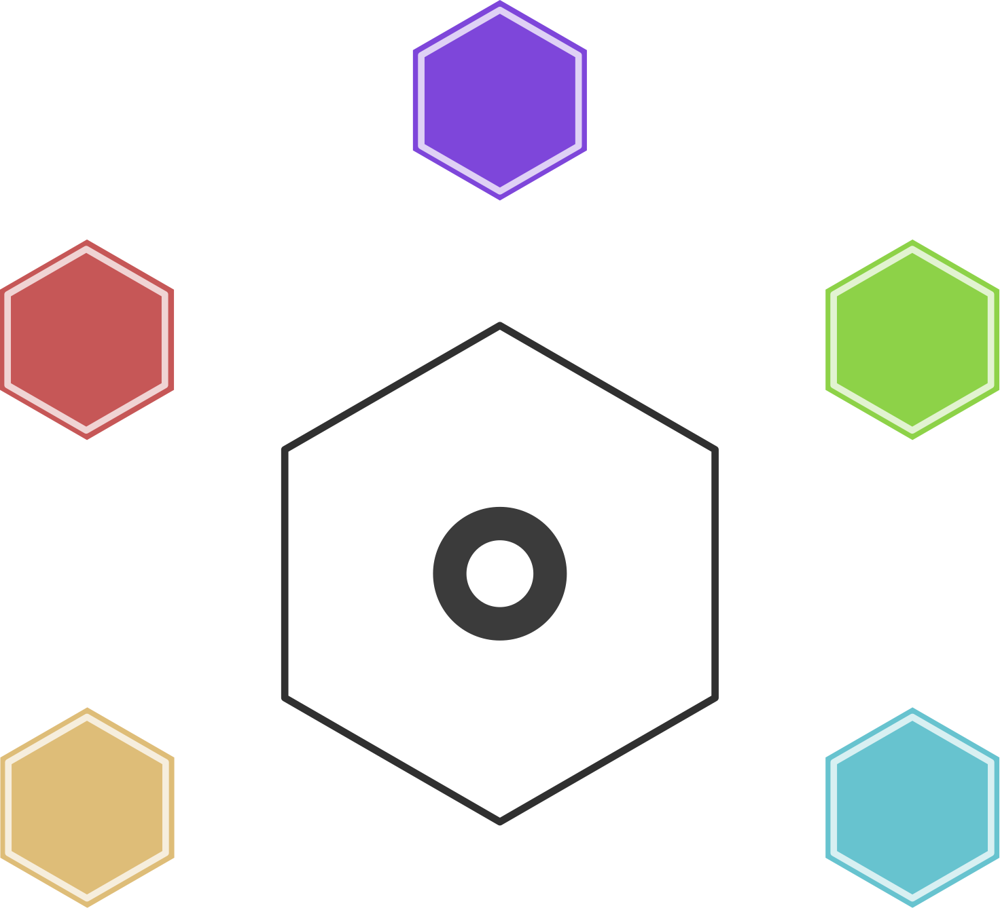

# 🎓 GL HUB



**GL HUB** est une plateforme éducative centralisée, conçue par un étudiant en Génie Logiciel pour ses pairs. Elle regroupe l'ensemble des ressources pédagogiques essentielles du cursus en un lieu unique, accessible à tous.

[](https://mhdev-x.github.io/GL-HUB/)
[](LICENSE)

---

## 📚 Table des matières

- [À propos](#-à-propos)
- [Fonctionnalités](#-fonctionnalités)
- [Comment fonctionne le déblocage par quiz](#comment-fonctionne-le-déblocage-par-quiz)
- [Matières couvertes](#-matières-couvertes)
- [Architecture technique](#architecture-technique)
- [Structure du projet](#-structure-du-projet)
- [Installer ou reprendre le projet](#installer-ou-reprendre-le-projet)
- [Gérer les quiz (administrateurs)](#gérer-les-quiz-administrateurs)
- [Contribution](#-contribution)
- [Auteur](#-auteur)
- [Licence](#-licence)

---

## 🎯 À propos

Face à la **dispersion des supports de cours** et au **manque de centralisation** des ressources pédagogiques, GL HUB propose un espace unique rassemblant les matières fondamentales du cursus de Génie Logiciel.

### Objectifs

- ✅ Faciliter l'accès aux cours magistraux, TD et projets académiques  
- ✅ Favoriser l'autonomie et la progression des étudiants  
- ✅ Devenir une référence durable pour la communauté étudiante  
- ✅ Encourager le partage, la collaboration et l'excellence

---

## ✨ Fonctionnalités

- 📚 **5 matières principales** organisées et accessibles  
- 📄 **57 ressources pédagogiques** (cours, TD, TP, projet d'examen)  
- 🆓 **100 % gratuit** : plus de paiement, on progresse en réussissant des quiz  
- 🔓 **Déblocage progressif des cours** : le premier cours de chaque matière est libre, les suivants se débloquent avec un quiz (70 % minimum). Les **TD sont libres pour tout le monde**  
- 🎲 **Quiz aléatoires** : deux étudiants n'ont pas forcément les mêmes questions  
- 📖 **Lecture en ligne ou téléchargement** de chaque ressource (pour les utilisateurs connectés)  
- 🕘 **Historique personnel** des dernières ressources lues et téléchargées  
- 👀 **Catalogue ouvert à tous** : tout visiteur voit les matières et peut utiliser la recherche, seule la lecture et le téléchargement demandent un compte  
- 🌗 **Thème clair et sombre**, interface responsive adaptée à tous les appareils  
- 🛠️ **Espace administrateur** pour gérer les étudiants et les questions de quiz

---

## Comment fonctionne le déblocage par quiz

1. **Crée un compte** (gratuit) et connecte-toi.
2. **Les TD, TP et projets sont libres** : tu peux les lire ou les télécharger tout de suite.
3. **Le premier cours** de chaque matière est libre aussi.
4. Pour débloquer le **cours suivant**, passe le **quiz du cours que tu viens de lire** : 10 questions tirées au hasard dans une banque de questions.
5. Il faut **70 % minimum**. En cas d'échec, tu peux réessayer après 2 minutes, avec des questions qui peuvent être différentes.
6. Après une réussite, tu vois la **correction** avec les explications, et le cours suivant est débloqué.
7. Les cours suivent un **ordre pédagogique** (Chapitre 1 avant Chapitre 2...). Chaque carte indique son numéro (« Cours 3 sur 8 ») ou « Accès libre » pour un TD.

Les administrateurs ont accès à toutes les ressources. Les étudiants qui avaient déjà payé l'ancien système (500 FCFA par ressource) ont gardé l'accès à leurs ressources.

---

## 📖 Matières couvertes

| Matière | Description | Lien |
|---------|-------------|------|
| **Langage C** | Généralités, structures conditionnelles et itératives, types composés, chaînes, tableaux, programmation modulaire | [Accéder →](langageC.html) |
| **Systèmes d'Exploitation** | Windows : dossiers et fichiers, utilisateurs locaux, restauration et tâches planifiées, batch, variables d'environnement | [Accéder →](systemedExploitation.html) |
| **Technologies Web** | HTML (listes, médias, liens, formulaires), CSS, JavaScript (DOM, Web Storage) | [Accéder →](technologieWeb.html) |
| **Base de Données** | Merise et MCD, modèle entité-association, SGBD, introduction au SQL | [Accéder →](basedeDonnees.html) |
| **Algorithmique** | Notions préliminaires, structures conditionnelles et itératives, types composés, chaînes, tableaux, programmation modulaire | [Accéder →](algo.html) |

---

## Architecture technique

- **Front-end** : HTML, CSS et JavaScript (sans framework), hébergé sur **GitHub Pages**. Icônes : Font Awesome.
- **Back-end** : [Supabase](https://supabase.com) (authentification, base PostgreSQL avec RLS, stockage privé, Edge Functions).

**Tables principales**

| Table | Rôle |
|-------|------|
| `matieres` | Les 5 matières |
| `ressources` | Les fichiers pédagogiques, avec leur `ordre` dans la matière |
| `questions_quiz` | La banque de questions (lisible uniquement par les administrateurs) |
| `tentatives_quiz` | Chaque passage de quiz : questions tirées, score, réussite |
| `deblocages` | Les ressources débloquées par chaque étudiant |
| `evenements_ressources` | L'historique des lectures et téléchargements |
| `profils`, `admins` | Profils des étudiants et comptes administrateurs |
| `paiements`, `liens_temporaires` | Ancien système de paiement, conservé mais plus utilisé |

**Edge Functions du système de quiz**

| Fonction | Rôle |
|----------|------|
| `quiz-start` | Vérifie l'accès, tire les questions au hasard et les envoie **sans les bonnes réponses** |
| `quiz-submit` | Corrige côté serveur, enregistre le score et débloque la ressource suivante |
| `resource-access` | Vérifie l'accès (TD libres, cours débloqués, admin) puis renvoie le fichier lui-même : aucun lien partageable n'est donné au navigateur |

**Sécurité** : les fichiers sont dans un stockage privé et livrés par une Edge Function qui revérifie l'accès à chaque lecture ou téléchargement (le navigateur ne reçoit jamais de lien réutilisable ni partageable), les quiz sont corrigés par le serveur, la table des questions est protégée par des règles RLS, et la recherche publique passe par une vue (`catalogue_public`) qui n'expose que le titre, le type et la matière : les visiteurs n'ont un droit de lecture que sur ces colonnes, jamais sur le chemin du fichier.

---

## 📁 Structure du projet

```text
GL-HUB/
├── index.html, contact.html, profil.html
├── langageC.html, systemedExploitation.html, technologieWeb.html
├── basedeDonnees.html, algo.html
├── admin.html, admin-quiz.html          # espace administrateur
├── supabaseClient.js                    # configuration Supabase (clé publique "anon")
├── auth.js                              # connexion, inscription, recherche
├── acces.js                             # lecture, téléchargement, quiz, déblocage
├── profil.js, admin.js, admin-quiz.js, theme.js
├── STYLES/                              # une feuille par page + theme.css, auth.css, acces.css
├── MEDIAS/
├── supabase/
│   ├── migrations/                      # scripts SQL, à lancer dans l'ordre
│   └── functions/                       # Edge Functions du quiz
├── LICENSE
└── SECURITY.md
```

---

## Installer ou reprendre le projet

1. Crée un projet Supabase et renseigne son URL et sa clé **anon** dans `supabaseClient.js`.
2. Crée les tables `matieres`, `ressources`, `paiements`, `admins` et `profils`, puis ajoute tes matières et tes ressources.
3. Dans le **SQL Editor**, lance les scripts de `supabase/migrations/` dans l'ordre :
   - `001_quiz_unlock.sql` : tables du quiz, règle d'accès, règles RLS ;
   - `002_reorganiser_ordre.sql` : ordre pédagogique des ressources (spécifique aux titres actuels, à adapter si tu changes les ressources) ;
   - `003_droits_lecture.sql` : droits de lecture des nouvelles tables ;
   - `004_recherche_publique_et_admin_quiz.sql` : recherche ouverte aux visiteurs et gestion des questions par les administrateurs.
   - `005_vue_catalogue_securisee.sql` : sécurise la vue de recherche (droits de lecture limités aux colonnes publiques) ;
   - `006_quiz_seulement_pour_les_cours.sql` : les quiz ne concernent que les cours, les TD sont libres.
4. Crée un **bucket privé** dans Storage et envoie-y tes fichiers. Le chemin de chaque fichier doit correspondre à la colonne `chemin_fichier` de `ressources`. Le nom attendu est `ressources-privees` (constante en haut de `supabase/functions/resource-access/index.ts`) ; s'il est différent, la fonction cherche automatiquement le fichier dans les autres buckets.
5. Déploie les trois fonctions de `supabase/functions/` (`supabase functions deploy quiz-start`, etc., ou en collant le code dans le tableau de bord Supabase). Chaque fichier est autonome.
6. Ajoute ton compte dans la table `admins` (`user_id` de ton compte) pour accéder à l'espace administrateur.

---

## Gérer les quiz (administrateurs)

Depuis l'espace **Admin → Quiz** (`admin-quiz.html`) :

- choisis une matière, puis une ressource : un badge indique combien de questions elle possède (**20 questions ou plus** sont conseillées pour varier les quiz, 10 au minimum) ;
- ajoute une question avec le formulaire (2 à 6 propositions, une bonne réponse, une explication facultative), modifie-la, désactive-la ou supprime-la ;
- ou **importe plusieurs questions d'un coup** en collant du JSON :

```json
[
  {
    "question": "Quelle boucle s'exécute au moins une fois ?",
    "options": ["Pour", "Tant que", "Répéter ... jusqu'à", "Aucune"],
    "bonne_reponse": "Répéter ... jusqu'à",
    "explication": "Le test est fait après le premier passage."
  }
]
```

Seuls les **cours** ont un quiz : les TD n'apparaissent qu'avec la mention « accès libre ». Le dernier cours de chaque matière n'a pas besoin de quiz, puisqu'il ne débloque rien. Un cours sans question bloque le cours suivant : pense à remplir la banque avant d'ouvrir une nouvelle matière au public.

---

## 🤝 Contribution

Les contributions sont les bienvenues ! Tu souhaites :

- 📚 Ajouter ou améliorer des ressources pédagogiques  
- 🐛 Corriger un bug ou améliorer l'interface  
- 💡 Proposer une nouvelle fonctionnalité  

Merci de :

1. **Forker** le projet  
2. **Créer une branche** (`git checkout -b feature/amélioration`)  
3. **Commit** tes changements (`git commit -m 'Ajout d'une ressource'`)  
4. **Pousser** la branche (`git push origin feature/amélioration`)  
5. **Ouvrir une Pull Request**

---

## 👤 Auteur

**Mohamed BATHILY** – Étudiant en Génie Logiciel  

- GitHub : [@mhdev-x](https://github.com/mhdev-x)  
- Projet : [GL HUB](https://github.com/mhdev-x/GL-HUB)

---

## 📄 Licence

Ce projet est sous licence **MIT** – voir le fichier [LICENSE](LICENSE) pour plus de détails.